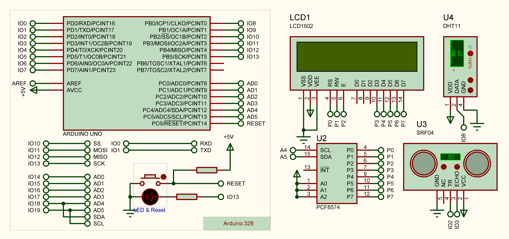

# 利用Arduino开发感应式温度湿度检测

## 项目介绍
本项目基于Arduino开发，利用HC-SR04超声波测距模块、DHT11温湿度传感器和1602液晶屏实现了感应式温度湿度检测的功能。当人靠近40cm时，超声波测距模块会探测到距离并点亮液晶显示屏，同时DHT11传感器采集到温湿度数据并显示在液晶屏上。随着人离开，超声波测距模块检测到的距离会大于40cm，液晶屏则会清空。通过此设计，可以实现对环境温湿度变化的实时监测和提醒，具有一定的实际应用价值。

## 所需材料
- Arduino UNO主控板 x1
- HC-SR04超声波测距模块 x1
- DHT11温湿度传感器 x1
- 1602液晶屏 x1
- 面包板 x1
- 杜邦线若干

## 硬件连接
1. 将HC-SR04超声波测距模块的Trig引脚连接至Arduino的2号引脚，Echo引脚连接至3号引脚。
2. 将DHT11温湿度传感器的VCC引脚连接至Arduino的5V接口，GND引脚连接至GND接口，Data引脚连接至8号接口。
3. 将1602液晶屏接口连接至转接板上，转接板的SDA接至A4接口，SCL接至A5接口。
4. 按照上述连接方式将模块插入到面包板中，注意不同引脚之间不要短路。

## 软件实现
1. 首先编写setup()函数，初始化1602液晶屏、DHT11温湿度传感器和HC-SR04超声波测距模块。
```C++
void setup() {
  Serial.begin(9600);
  pinMode(TRIG_PIN, OUTPUT);
  pinMode(ECHO_PIN, INPUT);
  lcd.init();  // 初始化LCD
  lcd.noBacklight();
}
```
2. 编写loop()函数，实现检测人距离项目的距离并根据距离是否小于40cm来点亮1602液晶屏并显示DHT11传感器采集到的温湿度数据。
```C++
void loop() {
  float distanceSum = 0;  // 初始化距离累加和
  for (int i = 0; i < NUM_READINGS; i++) {
    distanceSum += len();  // 将距离累加到距离累加和中
  }
  float average_distance = distanceSum / NUM_READINGS;  // 计算平均距离
  if (average_distance < MAX_LEN) {
    tag = true;  // 标记需要读取 DHT11 数据并显示到 LCD 上
  } else {
    if (tag == true) {  // 如果之前已经读取过数据且距离超过了阈值
      delay(5000);
      if (len() > MAX_LEN) {
        lcd.noBacklight();  // 关闭 LCD 背光
        tag = false;        // 取消标记
      }
    } else {
      delay(1000);
    }
  }

  if (tag) {
    int check_result = dht.read(DHT_PIN);
    lcd.setCursor(0, 0);  //设置显示指针
    lcd.print("Temp:");   //输出字符到LCD1602上
    lcd.print((float)dht.temperature, 2);
    lcd.setCursor(0, 1);
    lcd.print("Hum:");  //输出字符到LCD1602上
    lcd.print((float)dht.humidity, 2);
    lcd.print('%');
    lcd.backlight();
    delay(1000);
  }
}
```
3. 完整代码如下：
```C++
#include <dht11.h>
#include <Wire.h>
#include <LiquidCrystal_I2C.h>  //引用I2C库

//设置LCD1602设备地址，这里的地址是0x3F，一般是0x20，或者0x27，具体看模块手册
LiquidCrystal_I2C lcd(0x27, 16, 2);
dht11 dht;

// 将 DHT 引脚指定为 8
#define DHT_PIN 8

// HC-SR04 超声波模块测距
#define TRIG_PIN 2  //引脚 Tring 连接 IO D2
#define ECHO_PIN 3  //引脚 Echo 连接 IO D3

bool tag = 0;
const int NUM_READINGS = 10;  //平均距离读数
const int SOUND_SPEED = 343;  //声速（单位：m/s）
const int MAX_LEN = 40;

float len() {
  digitalWrite(TRIG_PIN, LOW);
  delayMicroseconds(2);
  digitalWrite(TRIG_PIN, HIGH);
  delayMicroseconds(10);
  digitalWrite(TRIG_PIN, LOW);

  float pulse_duration = pulseIn(ECHO_PIN, HIGH);
  float cm = pulse_duration * 16.3 / 1000 - 1;  //将回波时间转换为厘米单位
  return cm;
}

void setup() {
  Serial.begin(9600);
  pinMode(TRIG_PIN, OUTPUT);
  pinMode(ECHO_PIN, INPUT);
  lcd.init();  // 初始化LCD
  lcd.noBacklight();
}

void loop() {
  float distanceSum = 0;  // 初始化距离累加和
  for (int i = 0; i < NUM_READINGS; i++) {
    distanceSum += len();  // 将距离累加到距离累加和中
  }
  float average_distance = distanceSum / NUM_READINGS;  // 计算平均距离
  if (average_distance < MAX_LEN) {
    tag = true;  // 标记需要读取 DHT11 数据并显示到 LCD 上
  } else {
    if (tag == true) {  // 如果之前已经读取过数据且距离超过了阈值
      delay(5000);
      if (len() > MAX_LEN) {
        lcd.noBacklight();  // 关闭 LCD 背光
        tag = false;        // 取消标记
      }
    } else {
      delay(1000);
    }
  }

  if (tag) {
    int check_result = dht.read(DHT_PIN);
    lcd.setCursor(0, 0);  //设置显示指针
    lcd.print("Temp:");   //输出字符到LCD1602上
    lcd.print((float)dht.temperature, 2);
    lcd.setCursor(0, 1);
    lcd.print("Hum:");  //输出字符到LCD1602上
    lcd.print((float)dht.humidity, 2);
    lcd.print('%');
    lcd.backlight();
    delay(1000);
  }
}
```

## 电路图设计



## 使用方法

1. 将以上连接好模块的面包板插入Arduino主控板中。
2. 将Arduino主控板接入电脑，打开Arduino IDE软件。
3. 将上述代码复制到IDE软件中，并点击上传按钮将代码上传至Arduino主控板中。
4. 用手靠近HC-SR04超声波测距模块，当距离小于等于40cm时1602液晶屏会显示DHT11传感器采集到的温湿度数据。
